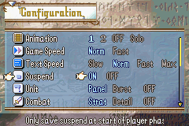

# Abstract

## Installation

You can choose from the following options:

1. LTS release version only: download [the latest FEBuilder release (Laqieer branch)](https://nightly.link/laqieer/FEBuilderGBA/workflows/msbuild/master) and install C-SkillSys in **Patches** form.

2. Release version only: Download UPS or EA buildfile from [release page](https://github.com/FireEmblemUniverse/fe8u-cskillsys/releases), and install the patch to your ROM.

	- [Patch ROM via UPS](https://feuniverse.us/t/how-to-patch-a-rom-v5/10329)
	- [EA buildfile tutorial](https://tutorial.feuniverse.us/)

3. [Custom build](./CustomBuild.md)

> [!WARNING]
> 1. It is only recommanded to install C-SkillSys to a clean FE8 rom.
> 2. Please see [Limitations](./Limitations.md) doc before you want to do any futher hacks.
> 3. If you use the 2nd or 3rd solution, please manually place the completed Patches directory into the FEB directory: `FEBuilderGBA\config\patch2\FE8U`.

## Skill

- [Skills glossary](./SkillInfo.md)
- [SkillSystem](./SkillSys.md)

- 500+ skills in implement.
- Learnable equipable in prepscreen (designer configurable).
- Skill scroll activated.
- Skill activate anim for both banim/mapanim.

## Combat art

[Art](./CombatArt.md)

## Battle calculate

- STR/MAG splited.
- Attack speed decay: (`weight - con`) --> (`weight - (con + atk * 20%)`)
- Nosferatu hp-drain percentage: 100% --> 50%.
- Critical damage correction is 300% in default, can be changed by skills.
- Effectiveness damage correct is 200% in default, can be changed by skills.
- Unit can use real damage via skills to ignore vanilla damage calculation.
- Riders may suffer `avo -20%` indoor.

## Weapon

- Unit use weapon with **S rank** may hold atk+1 and neglect attack speed decay.

## Combo-attack

When attacking the enemy within the range of the companion, ally will participate in the combo attack.

## Surrounder

When a unit is attacked and adjacent to the enemy, each side with enemy may cause unit `avo -10%`. If completely surrounded (each side stands an enemy), unit may cause `def-5` additionally.

Flyer in outdoor environments are not affected by this effect

## Ranged attack

For non-ballista combat, it will cause the battle actor lose hit rate with the attack distance increases (`hit -10%` per distance).

## Convoy

Convoy items has been expanded to 200.

## Suspend

Suspend data may only auto saved at the start of the player-phase so as to realize a simple "undo" action.

And this option is runtime-configurable.

## Gaiden style magic

FE-Gaiden style B.Mag and W.Mag have been implemented. Unit can cost HP to use magic.

## Debuff

[Debuff](./Debuff.md)

Basic debuffs can keep no more than 3 turns.

Some combat related debuffs can overlap and exist simultaneously but just hold one turn.

## Shield

[Shield](./ShieldItem.md)

## System config

[SystemConfig](./SystemConfig.md)

# Credits

[Credits doc](./Credits.md)
