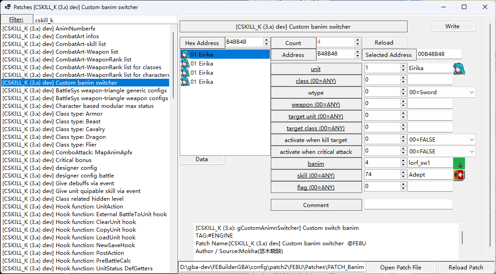

# 1. Custom banim switcher

Thanks to in-depth research on combo-attacks, the animation switching technology developed from it can be further extended to broader scenarios, such as allowing players to customize the playback of special animations in specific situations.

Banims could be custom swiched to other by patch "**Csustom banim switcher**", The configurable contents are as follows:

- `unit`

	attacker to switch banim

- `class`

	(Optional, 00=ANY.)

	only effective when unit is specific class.

- `wtype`

	attacker can switch to banim only when the wtype is matched.

- `weapon`

	(Optional, 00=ANY.)

	attacker can switch to banim only when he use the specific weapon.

- `target unit`

	(Optional, 00=ANY.)

	only effective when target is specific unit.

- `target class`

	(Optional, 00=ANY.)

	only effective when target is specific class.

- `activate when kill target`

	not to take effect if not killing hit.

- `activate when critical attack`

	not to take effect if not critical attack.

- `banim`

	**banim index**

- `skill`

	(Optional, 00=ANY.)

	only effective when specific skill is activated.

- `flag`

	(Optional, 00=ANY.)

	only effective when specific event flag is set.
