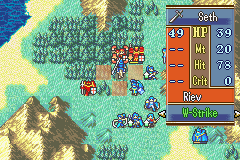
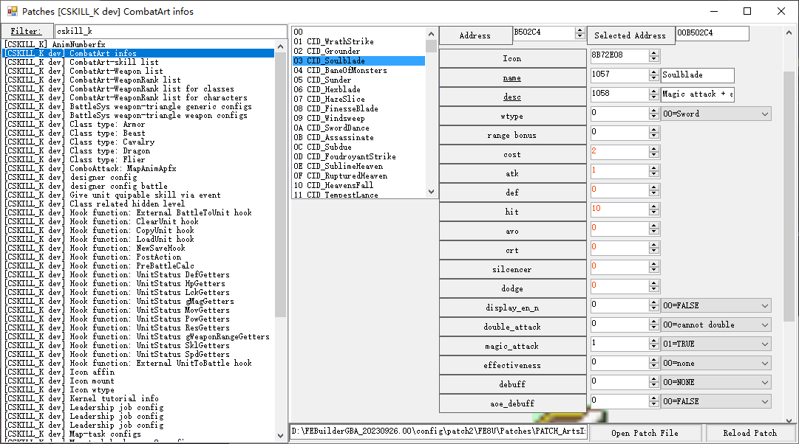
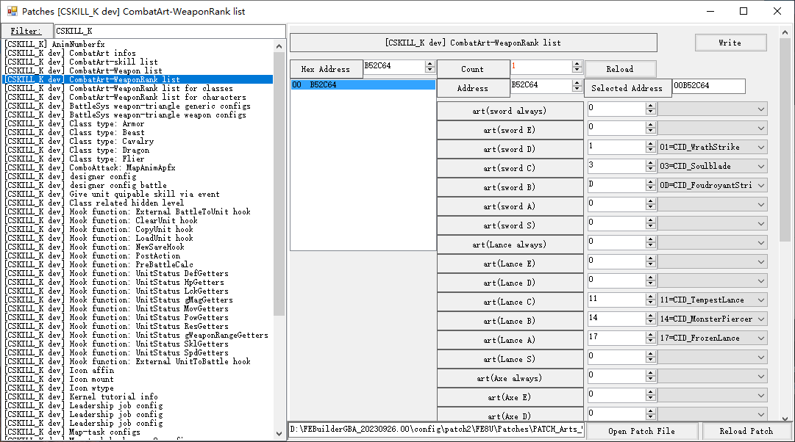
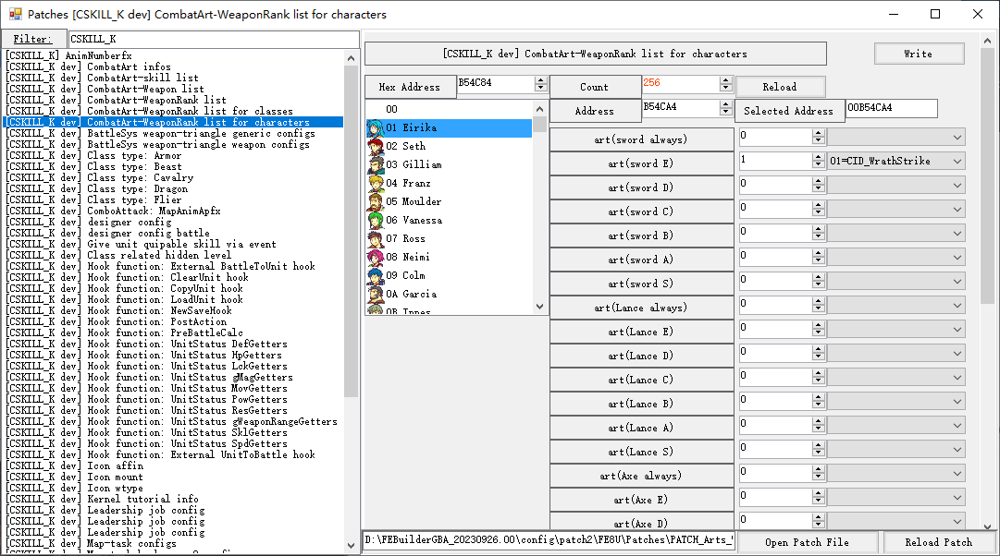
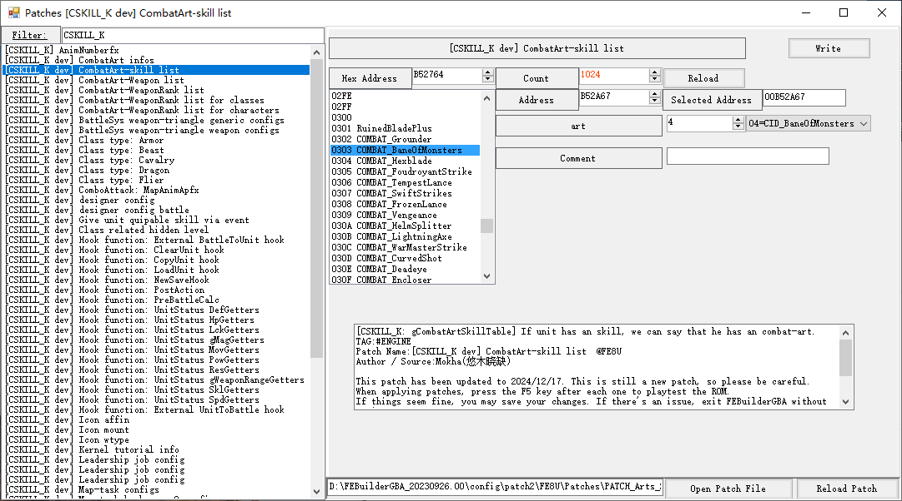
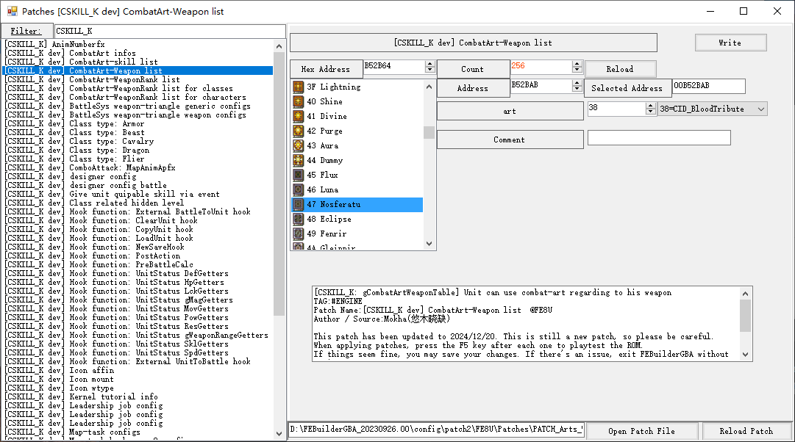

# Combat Art

FE-ThreeHoses style combat-art has been implemented. You can select art during target-selection.

- Advantages
	1. More damage/hit.
	2. Some powerful special effects depends on each arts.

- Disadvantages
	1. More consumption on weapon.
	2. Cannot double attack except in special circumstances.

## Editor

Kernel offers several FEB patches for designers

## Art info

This list may configure the basic info for each arts.

- `Icon`

	16*16 item-icon paletted combat-art icon.

- `name`

	Art name during selection. **MUST** be set.

- `desc`

	Art description

- `wtype`

	Art weapon type for art selection. Set `0xFF` is you want it enabled for all types.

- `range bonus`

	Additional weapon range, especially for bow (and magic) related arts.

- `cost`

	Weapon cost for each hit.

- `atk/def/hit/avo/crit/silcencer/dodge`

	Battle status correction

- `display_en_n`

	- `0`: Display formatted battle status info in RText, and left one line for description.
	- `1`: Not to display formatted info in RText, and directly display 3 lines' desc.

- `double_attack`

	- `0`: Unit cannot double attack when he use this art.
	- `1`: Unit can double attack based on normal judgement.
	- `2`: Unit can double attack forcefully regardless normal judgement.

- `magic_attack`

	Force set the attack attribute to magic attack, calculate damaged based on actor's `MAG` and foe's `RES`.

- `effectiveness`

	- `0`: No effect.
	- `1`: effective to all.
	- `2`: effective to armor (based on FEB patch: **Class type: Armor**)
	- `3`: effective to cavalry (based on FEB patch: **Class type: Cavalry**)
	- `4`: effective to flier (based on FEB patch: **Class type: Flier**)
	- `5`: effective to dragon (based on FEB patch: **Class type: Dragon**)
	- `6`: effective to monster (based on FEB patch: **Class type: Beast**)

- `debuff`

	Inflect debuff to the foe if hitted.

- `aoe_debuff`

	Cause AOE effect in 2x2 range if hitted.

## Art-WRank generic list

Anyone who reached the corresponding weapon rank, then he can use the art.

## Art-WRank person based list

If the unit reached the corresponding weapon rank, then he can use the art.

## Art-WRank job based list

If the unit as the specific job reached the corresponding weapon rank, then he can use the art.

## Art-Skill list

If unit holds the skill, then he can use the art.

## Art-Weapon list

If unit equips the weapon, then he can use the art.
