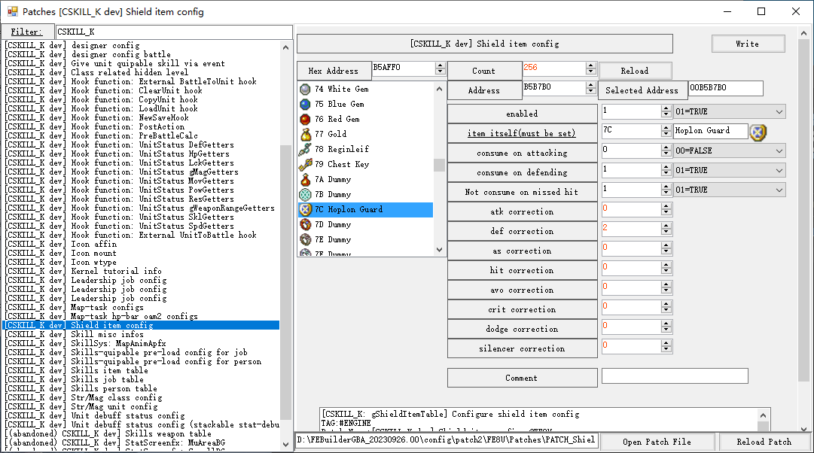

# Shield

The "Shield" is the second equippable item in c-skillsys, distinct from the "Weapon". It provides damage correction during battle.

The shield can be understood as a physical shield, but it can also be seen as a talisman. Each character can equip an item as a shield in addition to their weapon. The shield, like the weapon, will be consumed as the battle hits. Game designers can choose when the shield item durability is consumed in the following scenarios:

- When attacking
- When defending

Additionally, it can be set to consume the shield item only when a hit is not missed.

Shile item config can be set via FEB patch: `Shile item config`, The configurable contents are as follows:

- `enabled`

	Set the item as equipable shield.

- `item itself`

	An internal identifier, must be set as itself

- `consume on attacking`

	Talisman may lose duration on each hit round as attacker.

- `consume on defending`

	Shield may lose duration on each hit round as attacker.

- `Not consume on missed hit`

	Shield/Talisman may not lose duration if on missed attacking.

- Battle status corrections

	Modify each battle status on equipment

- Unit status bonus

	Modify each unit status on equipment

- Unit growth bonus

	Modify each unit growth rate on equipment

- skills

	Battle unit only: hold the skill if he equips the shield.
