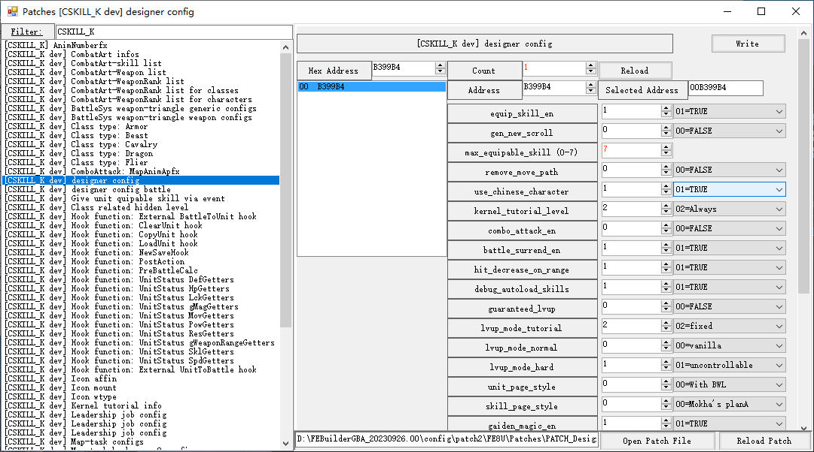
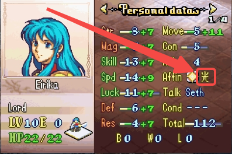
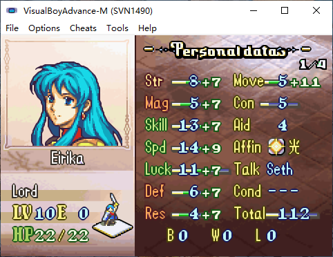
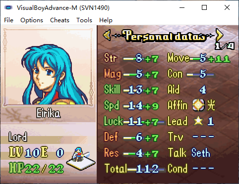
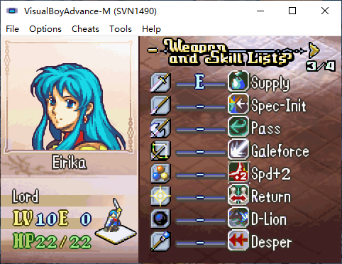
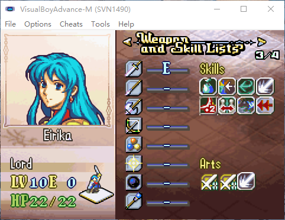
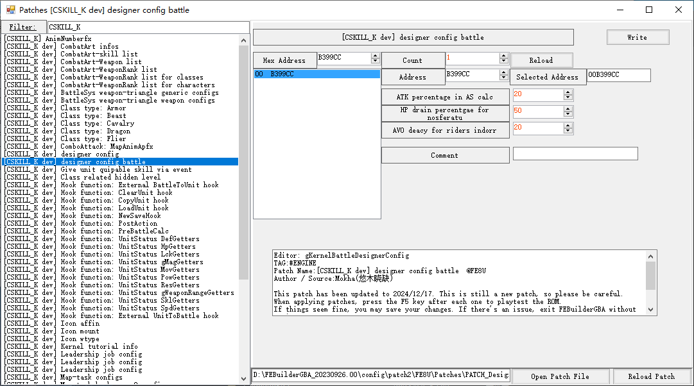
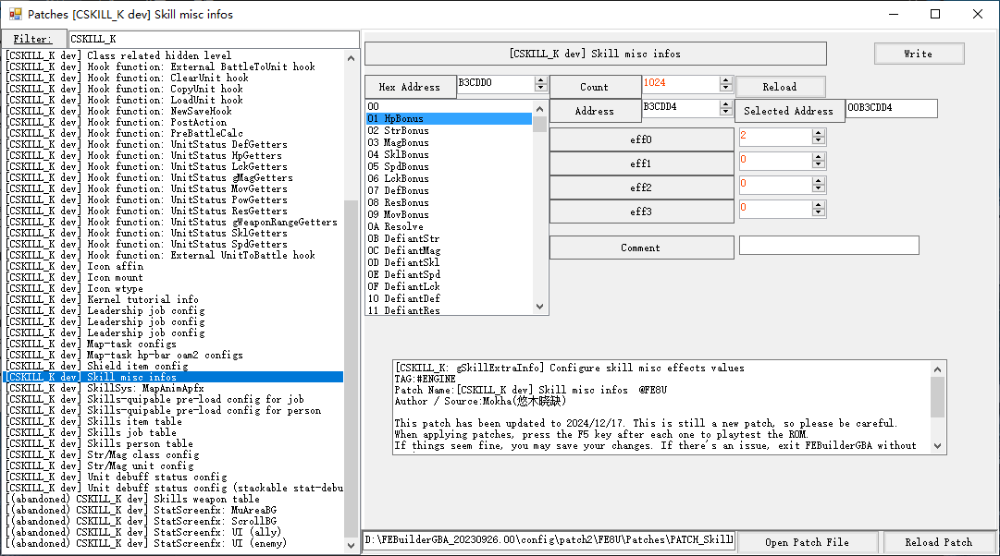

C-SkillSys offers several patches to allow game-designers to configure some of the underlying logic of the game without touching the code.

## Designer config

- `equip_skill_en`

	Three-Houses style skill equipment in prepscreen is enabled to Allow units equip skills in prepscreen. Otherwise the entrance of equip option in prepscreen will be removed.

- `gen_new_scroll`

	When unit uses skill scroll who's skill equipable slot has been fullfilled, c-skillsys can choose one of the following options:

	- `0`: Three houses style: just register the new skill into the character's list of learned skills. And then he may equip that skill in prepscreen.

	- `1`: Old style: allow players remove an existing skill on unit and generated a new skill scroll.

- `max_equipable_skill`

	The total number of skills that can be dynamically disassembled for each character (0-7).

- `remove_move_path`

	Disable move-path calculation and display.

	Since move-path can display no more than 20 steps in vanilla, with the increase of unit's mobility, this limitation may cause risk of overflow error. Thus we can directly remove the move-path to avoid overflow.

- `use_chinese_character`

	

	Display Chinese affin character in statscreen unit page.

- `kernel_tutorial_level`

	Optional display kernel system tutorial box.

	- `0`: Not show any kernel tutorial
	- `1`: Only show kernel tutorial in tutorial mode
	- `2`: show kernel tutorial at anytime

- `combo_attack_en`

	Enable FE-Engage style combo-attack.

- `battle_surrend_en`

	Enable battle status loss when unit is surrendered.

- `hit_decrease_on_range`

	Enable FE-ThreeHouses style hit rate loss for far-ranged attack.

- `debug_autoload_skills`

	**Debug option**, fullfill the unit learned-skills list so that he can freely select skills to equip in prepscreen.

- `guaranteed_lvup`

	If no status increases during level-up, kernel may retry 10 times with a 10% growth bonus.

- `lvup_mode_tutorial`

	Level up mode in tutorial mode,

	- `0`: GBA style lvup, same as vanilla
	- `1`: 3DS style lvup, uncontrollable random lvup
	- `2`: fixed lvup
	- `3`: 100% growth
	- `4`: 0% growth

- `lvup_mode_normal`

	Level up mode in normal mode, same as `lvup_mode_tutorial`.

- `lvup_mode_hard`

	Level up mode in hard mode, same as `lvup_mode_tutorial`.

- `unit_page_style`

	Display style of statscreen page1.

	- `0`: 
	- `1`: 

- `skill_page_style`

	Display style of statscreen page3.

	- `0`: 
	- `1`: 

- `gaiden_magic_en`

	Enable gaiden style black/white magic system.

- `gaiden_magic_must_be_magic`

	Weapons in gaiden B/W.mag selection can also be non-magic items.

- `gaiden_magic_requires_wrank`

	If unit can use one magic, he may use that weapon ragardless the weapon-rank level requirement.

- `gaiden_magic_ai_en`

	Enemies can also use gaiden magic on AI phase.

- `gaiden_magic_ext_conf_en`

	**Wizardry option**, enable `gGaidenChaxConfigs` judgement.

- `auto_narrow_font`

	Try convert ascii to **narrow-fonts** on displaying skill descriptions, skill names and menu items.

- `skill_sub_menu_width`

	Width of submenu after typing "Skills" option in action menu.

- `wrank_bonux_rtext_auto_gen`

	Display weapon rank battle bonus info in statscreen if it holds.

## Designer config battle

- `ATK percentage in AS calc`

	Attack speed decay: (weight - con) --> (weight - (con + atk * `[20%]`))

- `HP drain percentgae for nosferatu`

	Nosferatu hp-drain percentage: 100% --> `[50%]`.

- `AVO deacy for riders indorr`

	Riders may suffer (avo -`[20%]`) indoor.

- `CRIT damage correction rate`

	Critical attack may cause `[200%]` damage.

## Skill misc infos

Allow designers to customize some numerical attributes of skills. The meaning of each value is related to the skill. Please note that you need to be careful when modifying each of these values, as this may cause bugs.
